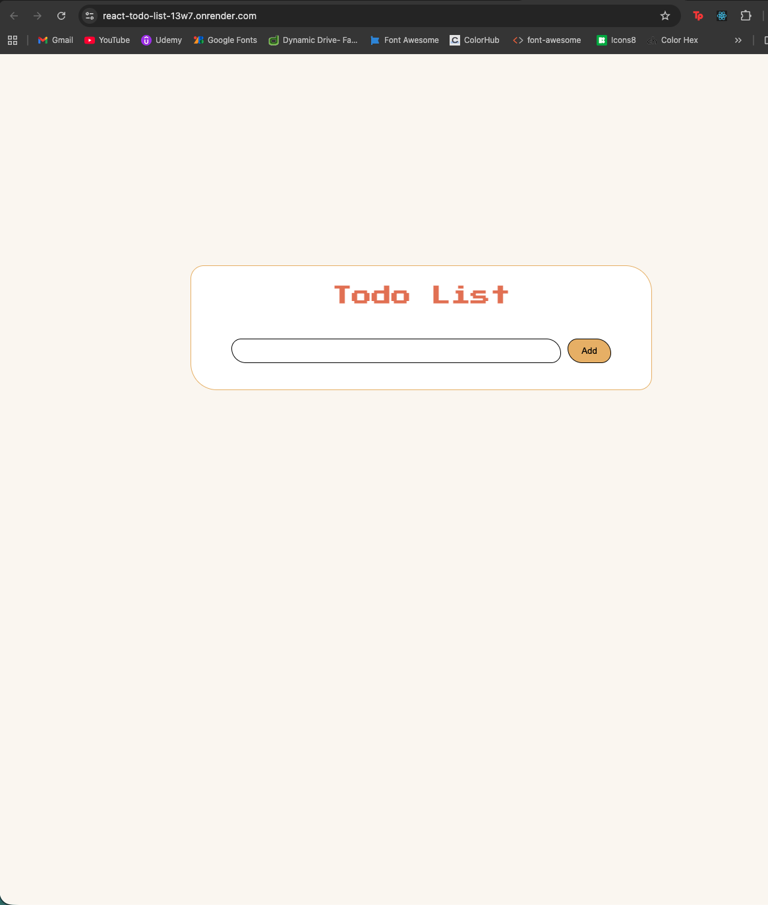
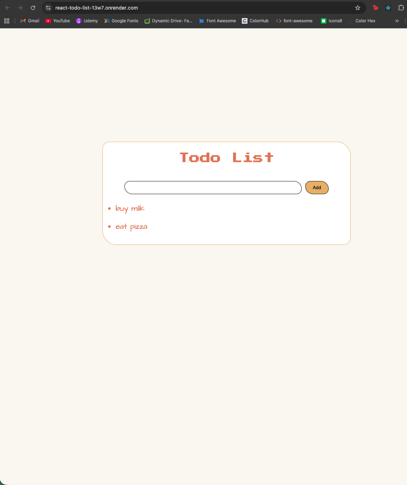

⚛️ React To-Do App

React.js | Hooks | State Management

A frontend-focused To-Do application built using React, demonstrating state management and dynamic UI updates.

🔍 About This Project
Built with React (functional components + hooks)
Focuses on managing UI state
Demonstrates component-based architecture

🚀 Live Demo
https://react-todo-list-13w7.onrender.com/

🧠 What I Learned
Managing state using useState
Handling events in React
Component structure and reusability
Dynamic rendering without page reload

🛠️ Tech Stack
Frontend
React.js
JavaScript
HTML
CSS

⚙️ Features
Add tasks
Delete tasks
Dynamic UI updates
Clean component structure

📸 Screenshots

🧪 Installation
git clone https://github.com/Baffyy/React-Todo-list.git
cd React-Todo-list
npm install
npm run dev

📈 Future Improvements
Add local storage
Edit tasks
Connect to backend
📌 Project Status

✅ Core functionality complete

🔗 Links

GitHub: https://github.com/Baffyy/React-Todo-list
Live: https://react-todo-list-13w7.onrender.com/

